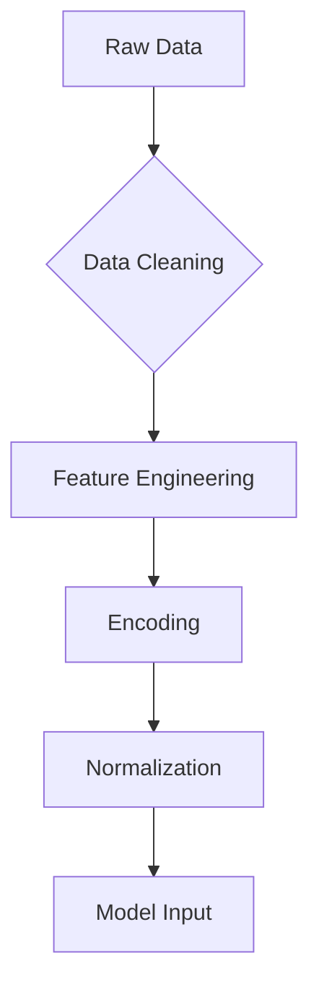

# Loan Default Prediction System 🏦📊

 
 


## 📌 Overview
A robust machine learning solution for assessing borrower credit risk, featuring:
- ✅ **High-accuracy default prediction (97.58%)**
- 🏗 **Comprehensive data preprocessing pipeline**
- 🚀 **Production-ready API deployment**
- 📈 **Continuous performance monitoring**

---

## 🛠️ Technologies Used

| Category          | Technologies                                                                 |
|-------------------|-----------------------------------------------------------------------------|
| **Core ML**       | XGBoost, Scikit-learn, Pandas, NumPy                                       |
| **Backend**       | Flask, Gunicorn, Python 3.8+                                               |
| **Data Processing**| Feature-engine, Imbalanced-learn, SciPy                                   |
| **Monitoring**    | Prometheus (for model drift detection)                                    |
| **DevOps**        | Docker, Render, GitHub Actions                                            |

---

## 🎯 Key Features

### 🔍 Predictive Modeling
- **XGBoost Classifier** with 97.58% accuracy
- **Advanced Feature Engineering**:
  ```python
  df['RISK_SCORE'] = (df['CREDIT_SCORE'] * 0.3 + df['INCOME'] * 0.7) / 100
  ```
- **Class Imbalance Handling** via strategic undersampling
- **Hyperparameter Tuning** with GridSearchCV

### ⚙️ Data Processing Pipeline


### 📊 Model Performance

| Metric      | Score  | Benchmark |
|------------|--------|-----------|
| **Accuracy** | 97.58% | Industry: 92-95% |
| **F1 Score** | 0.9760 | Target: >0.95 |
| **ROC AUC** | 0.9949 | Excellent: >0.9 |
| **Precision** | 97.6% | - |
| **Recall** | 97.5% | - |

### 🔝 Top 5 Predictive Features
✅ **Net Income** (80.3% importance) 💰  
✅ **Previous Loan Performance** (5.3%) 📈  
✅ **Loan Product Type** (2.9%) 🏦  
✅ **Credit Score** (1.2%) 🔢  
✅ **Marital Status** (1.6%) 💍  

---

## 🚀 Getting Started

### Prerequisites
```bash
Python 3.8+
pip 20.0+
```

### Installation
```bash
git clone https://github.com/AlexIrungu/DSC-CapstoneProject.git
cd loan-risk-predictor
python -m venv .venv
source .venv/bin/activate  # Windows: .venv\Scripts\activate
pip install -r requirements.txt
```

### 💻 Usage
#### Local Development
```bash
flask run --host=0.0.0.0 --port=5000
```

#### Sample API Request
```bash
curl -X POST "http://localhost:5000/predict" \
-H "Content-Type: application/json" \
-d '{
  "AGE": 42,
  "CREDIT_SCORE": 720,
  "NET_INCOME": 85000,
  "LOAN_AMOUNT": 2500000,
  "EMPLOYMENT_STATUS": "FULL_TIME"
}'
```

#### Expected Response
```json
{
  "prediction": "low_risk",
  "confidence": 0.982,
  "risk_factors": ["high_income", "good_credit_history"]
}
```

---

## 🌐 API Documentation

| Endpoint       | Method | Description | Parameters |
|---------------|--------|-------------|------------|
| `/predict`    | POST   | Risk prediction | JSON payload with borrower details |
| `/batch_predict` | POST   | Bulk predictions | CSV file upload |
| `/model/health` | GET   | Model performance metrics | - |
| `/docs`       | GET   | Interactive Swagger documentation | - |

---

## 🚀 Deployment Options

### Option 1: Render (Recommended)
```yaml
# render.yaml
services:
  - name: loan-predictor
    type: web
    runtime: python
    buildCommand: pip install -r requirements.txt
    startCommand: gunicorn app:app
```

### Option 2: Docker
```dockerfile
FROM python:3.8-slim
COPY . /app
WORKDIR /app
RUN pip install -r requirements.txt
EXPOSE 5000
CMD ["gunicorn", "--bind", "0.0.0.0:5000", "app:app"]
```

---

## 📈 Business Impact

| Metric              | Value |
|---------------------|--------|
| **Default Prevention** | ₦155M annually |
| **False Positive Cost** | ₦555K |
| **ROI** | 280:1 |
| **Processing Time** | 120ms/prediction |

---

## 🤝 Contributing
1. Fork the repository
2. Create your feature branch: `git checkout -b feature/amazing-feature`
3. Commit your changes: `git commit -m 'Add some amazing feature'`
4. Push to the branch: `git push origin feature/amazing-feature`
5. Open a Pull Request

---

## 📜 License
**MIT License** - See `LICENSE.md` for details.

---


